## Debianインストール方法

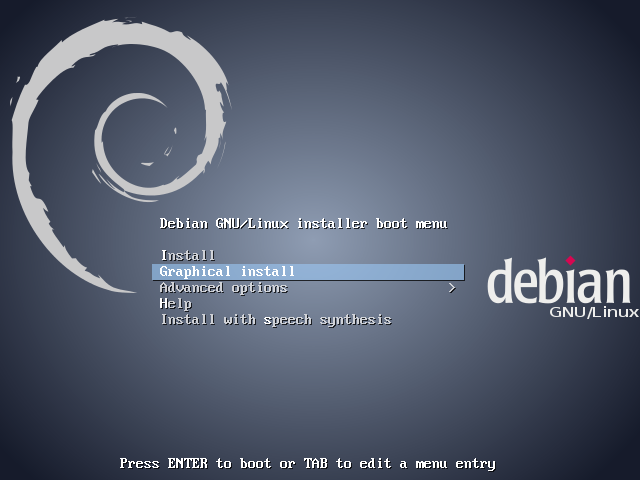

「Graphical Install」を矢印キーで選択して、Enterキーを押します。

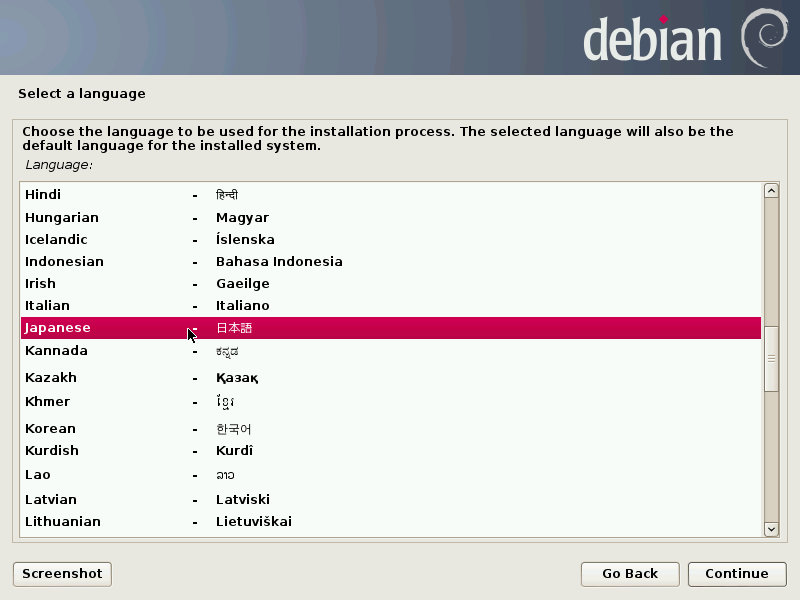

「Japanese」を選んで、「Continue」を押します。

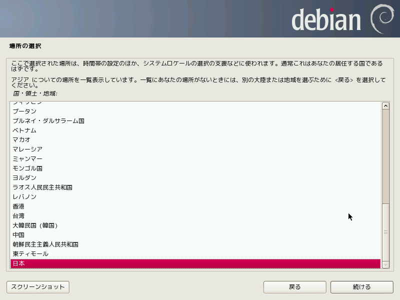

「日本」が選択されているはずなので、そのまま「続ける」をクリックします。

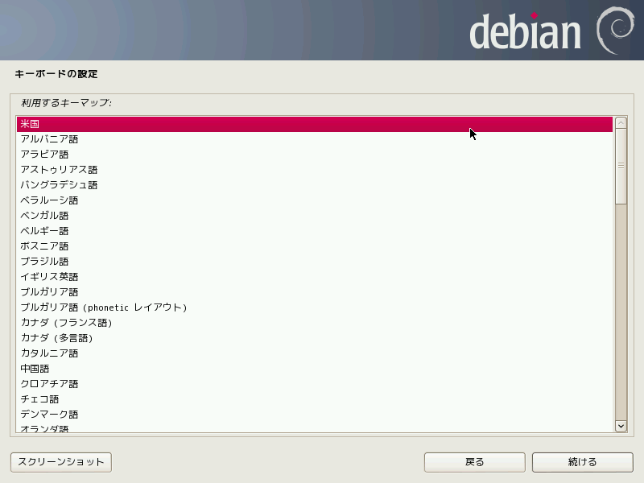

キーマップの設定は人によります。基本的にキーボードの「2」のキーの上に「"」がある人は日本、「@」がある人は米国を選択します。

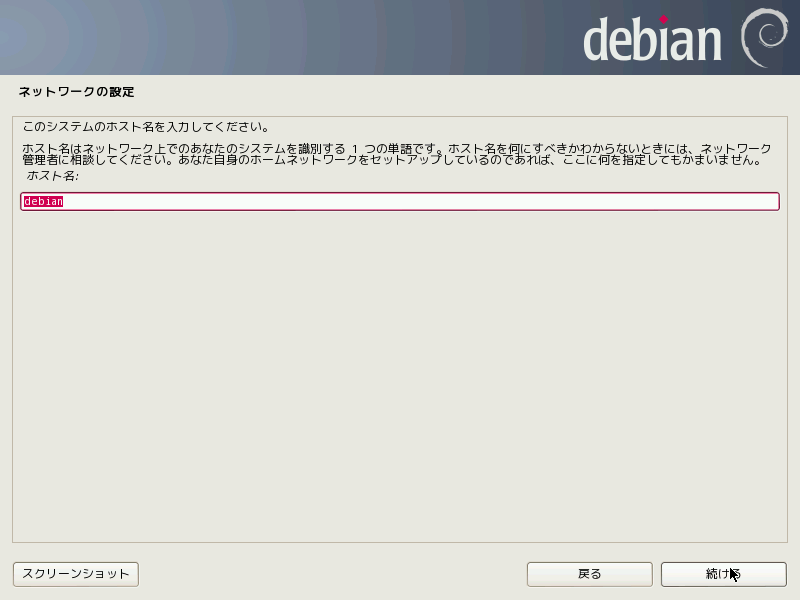

ホスト名は適当に決めて構いません。入力して「続ける」をクリックします。

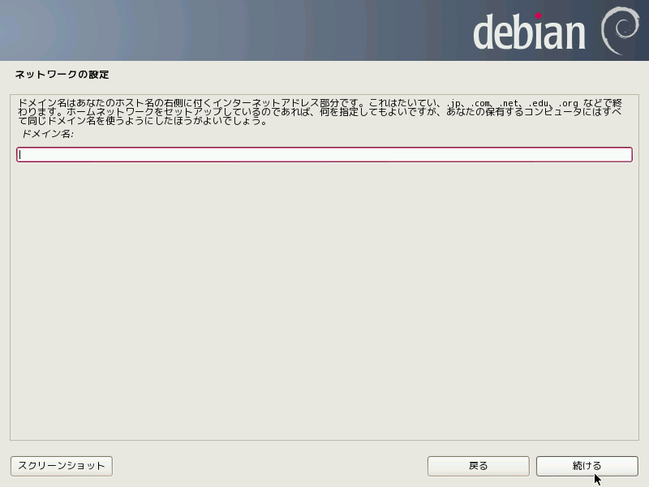

ドメイン名は何も入れなくていいです。

rootパスワードとは、Linuxに対してあらゆる操作を行う権利を持つ特別なユーザrootのパスワードです。非常に大事なものなので、適当に決めないようにしてください。また絶対に忘れないようにしてください。

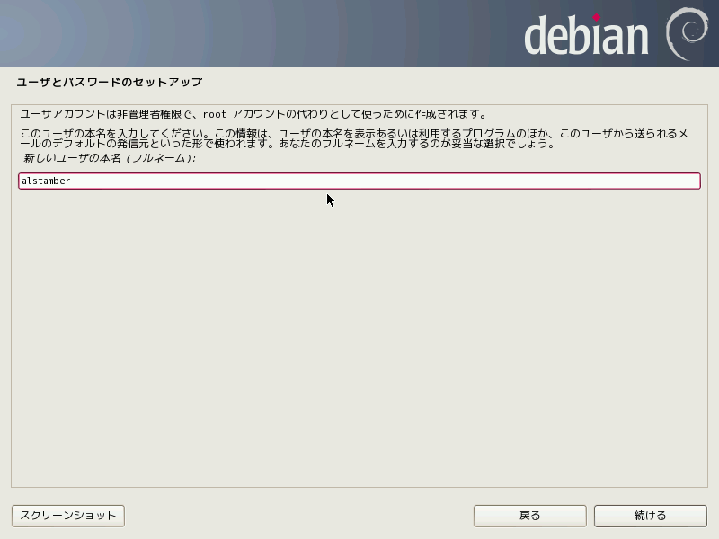

ユーザの本名とありますが、図のようにハンドルネームでも構いません。

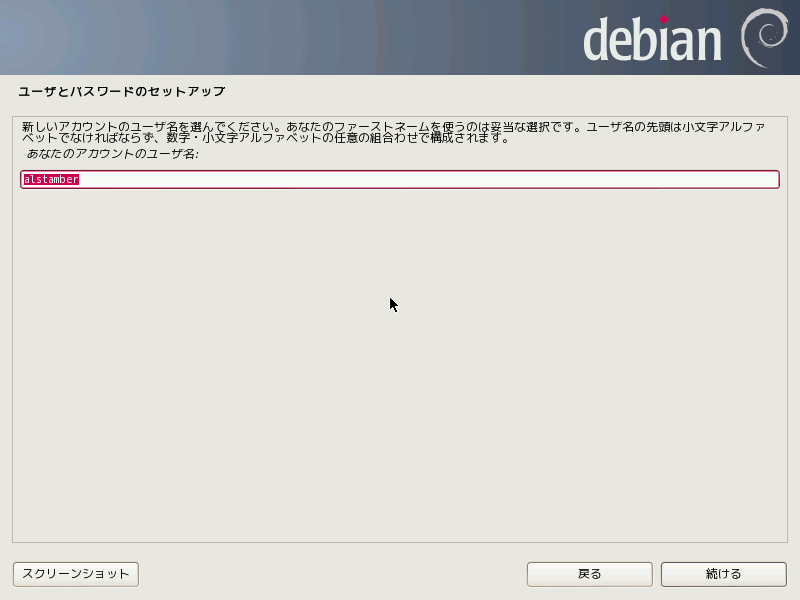

ログインする際のユーザIDを決めます。

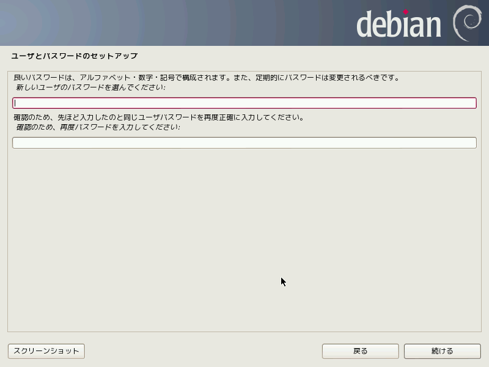

ログインする際のパスワードを決めます。これももちろん忘れてはいけません。

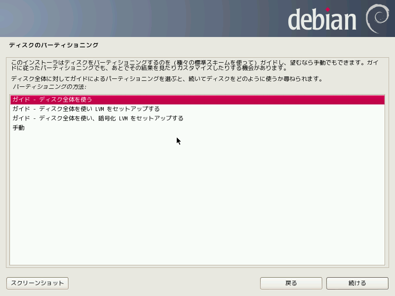

「ガイド - ディスク全体を使う」を選択した状態で進みます。

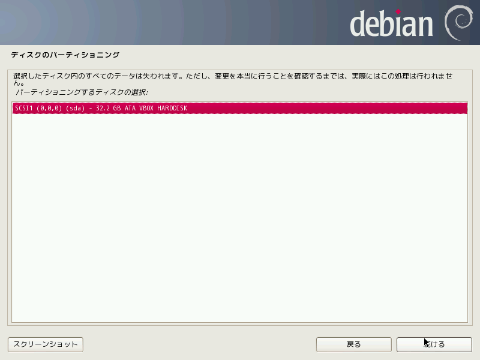

なにか出てきますが、これはそのまま「続ける」をクリックして構いません。

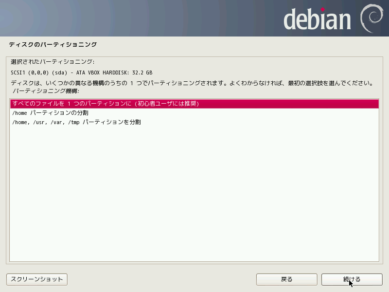

「すべてのファイルを一つのパーティションに」を選択した状態で、進みます。

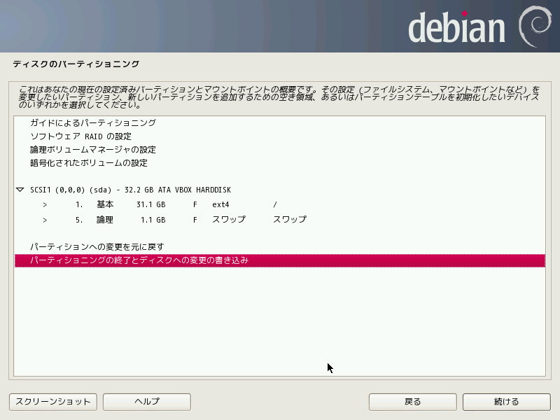

「パーティショニングの終了とディスクへの変更の書き込み」を選択して、進みます。次の画面では、「はい」をチェックして、進めます。

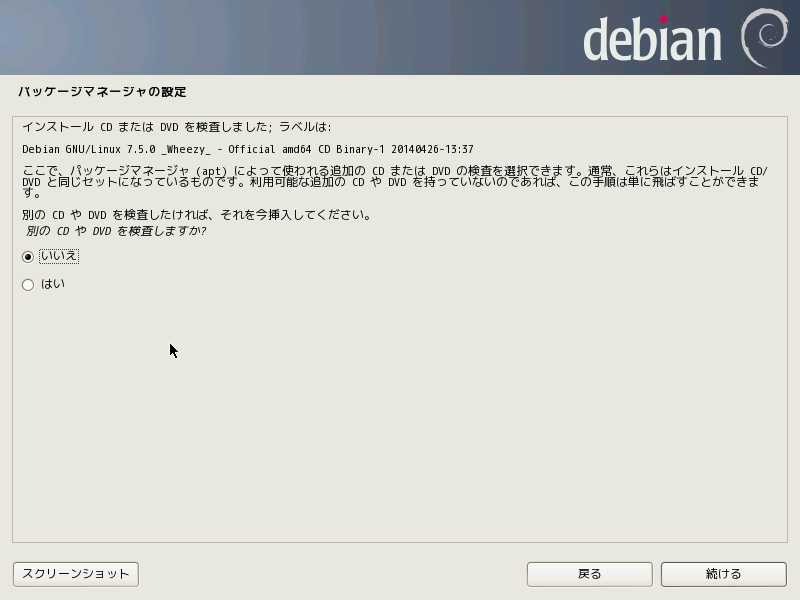

もしこのような画面が出てきたら、「いいえ」を選択して続けます。

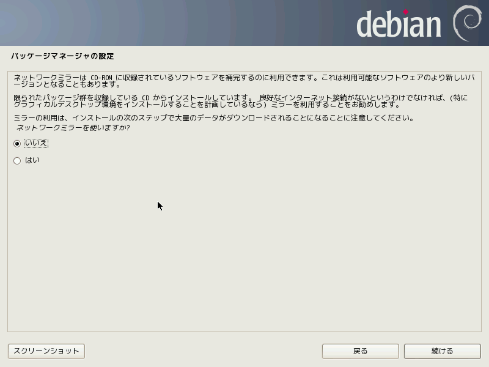

もしこのような画面が出てきたら「はい」を選択して続けます。

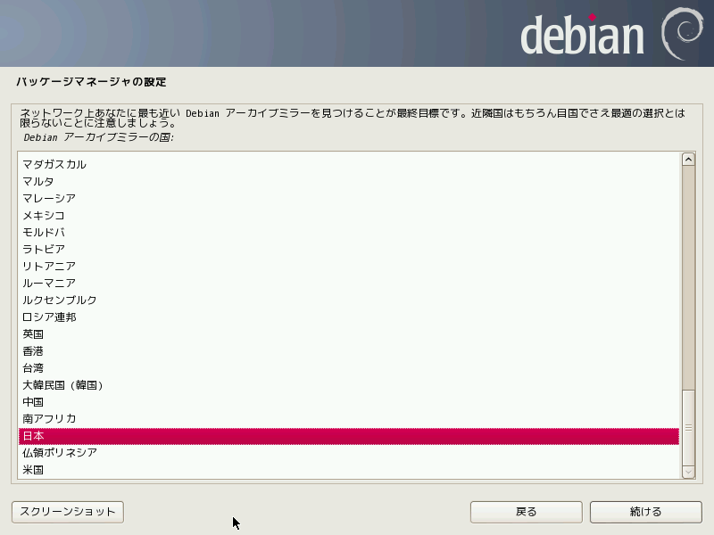

「日本」を選択して進めます。

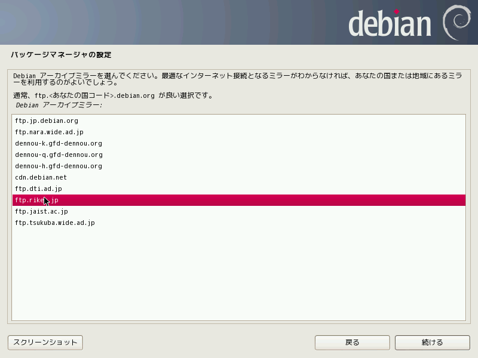

好きなサーバを選択して進めます。ここでは、理化学研究所のサーバを選んでいます。

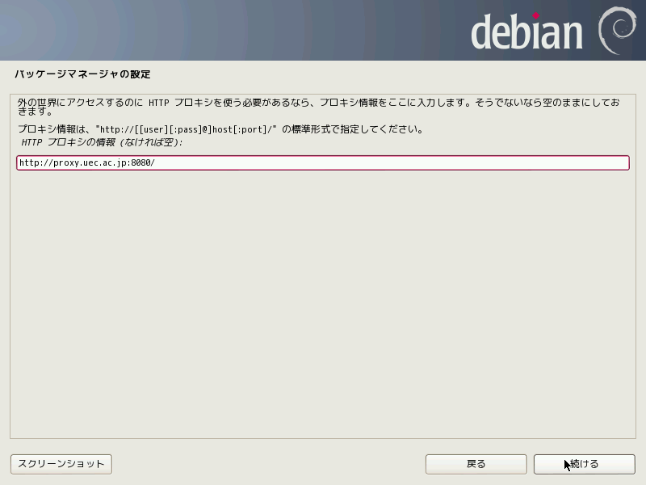

もし学内からセットアップしているなら、ここに「http://proxy.uec.ac.jp:8080/」と入力して進めます。
そうでない人は、何も入力する必要はありません。	

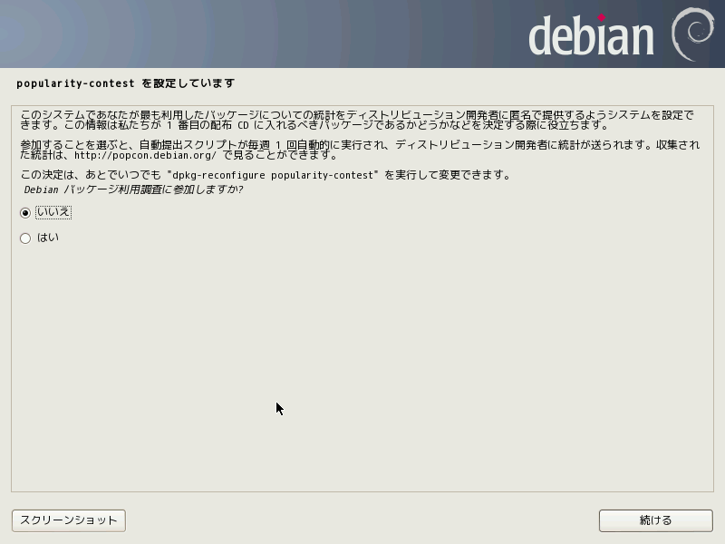

ここでも「いいえ」を選択します。

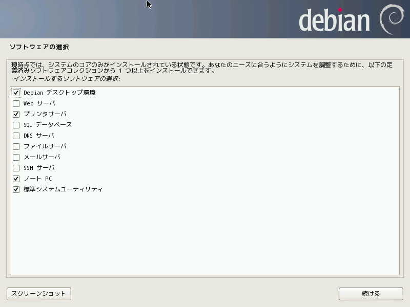

そのまま「続ける」をクリックします。

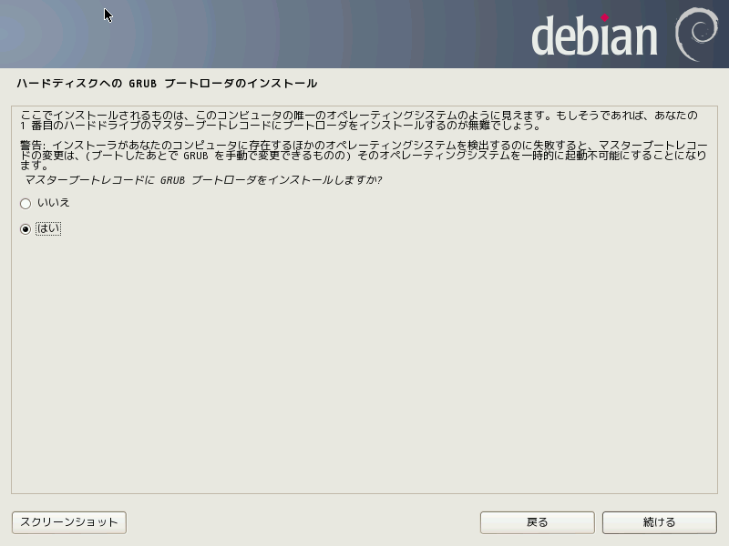

「はい」を選択した状態で、進めます。
