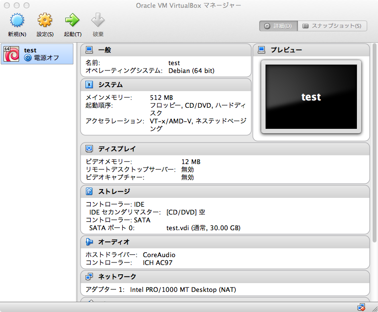
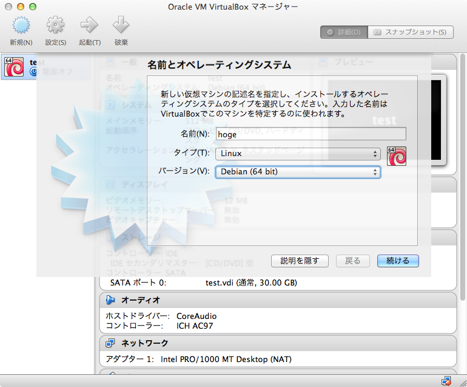
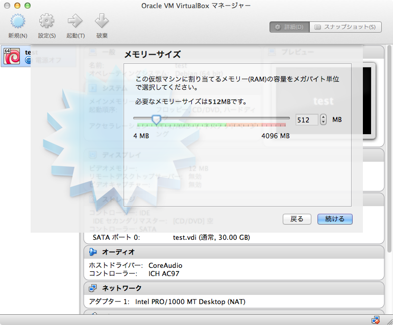
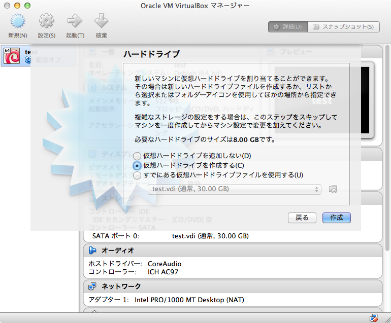
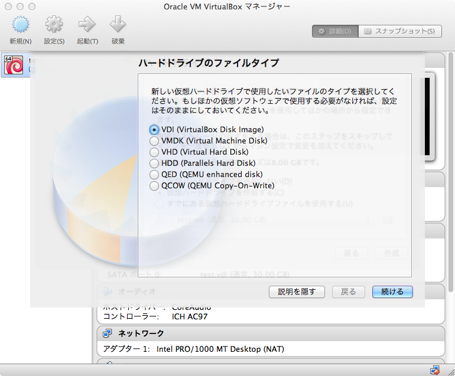
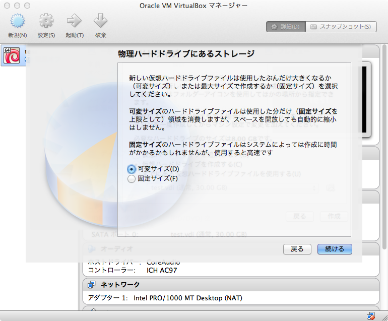
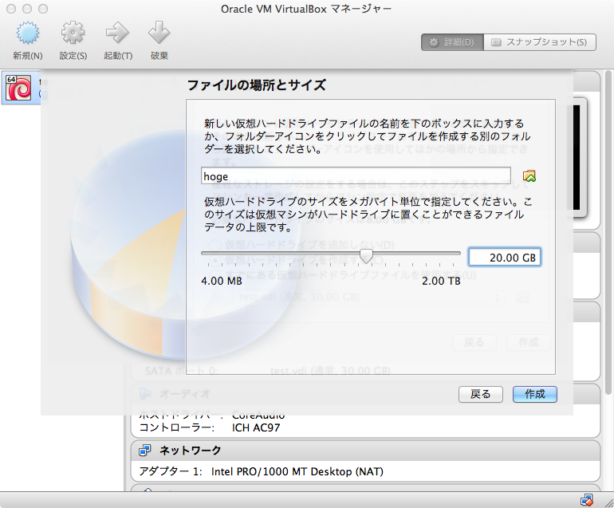

## 仮想マシン作成方法

左上の「新規」をクリックします。

名前を入力し、タイプを「Linux」、バージョンを「Debian (64bit)」にします。

そのまま「続ける」をクリックします。

「仮想ハードドライブを作成する」を選択して、「作成」をクリックします。

そのまま「続ける」をクリックします。

これも「続ける」です。

容量は20GBほどにしておきます。少なすぎるとLinuxのインストールが出来ません。
